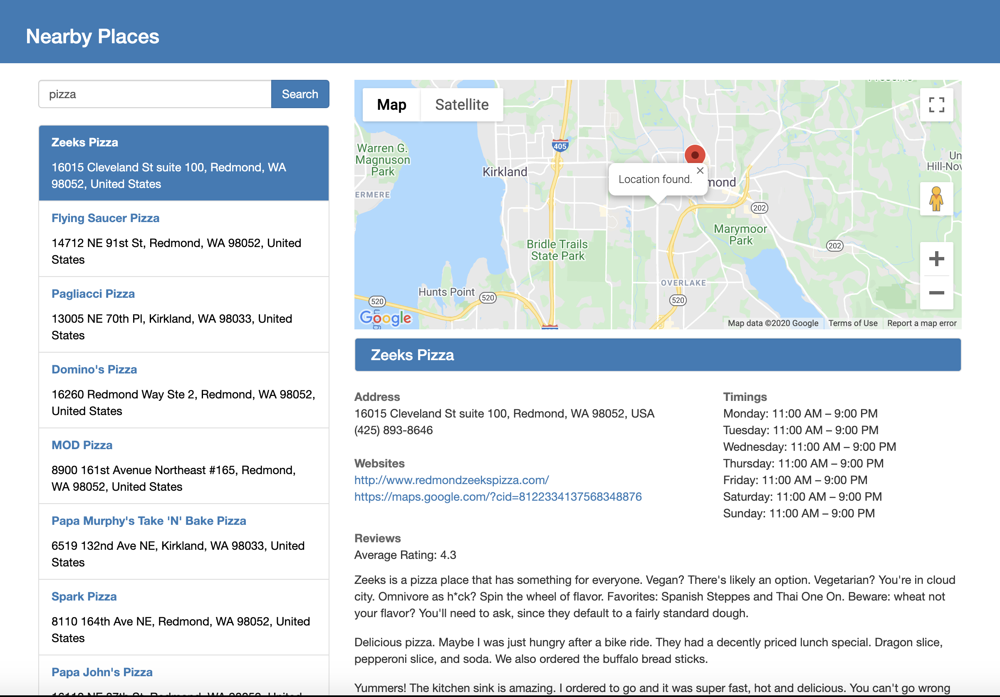

# NearbyPlaces
A webapp in AngularJs that lets you search for nearby places and shows details about the place. Uses Google Maps Javascript API.

Provides a query box and a search button and then calls the Places Library for Google Maps.
(https://developers.google.com/maps/documentation/javascript/places)

Note: Google Maps api asks for permis.sion to access your current location. Select Allow to use the Search nearby places feature.

Libraries used - 
AngularJs 
JQuery 
Bootstrap CSS

## Running locally

To run using node,
1. Go to folder and do **npm install**  
2. Install http-server, **npm install http-server -g** 
3. Start the server, **http-server** 
4. Go to the port at which the server starts, **http://127.0.0.1:8081/index.html**

## Web app

Web app is deplopyed at https://nearbyplaces-ccf85.firebaseapp.com/
